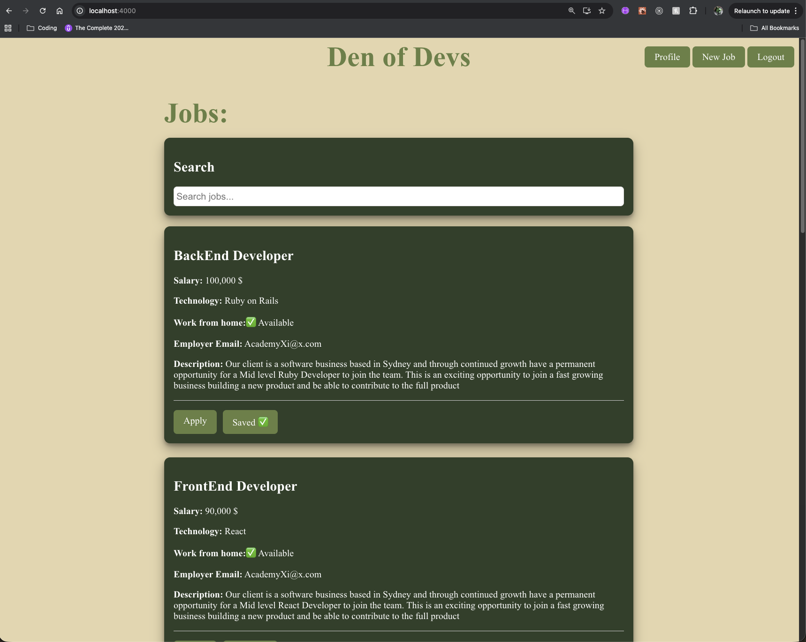
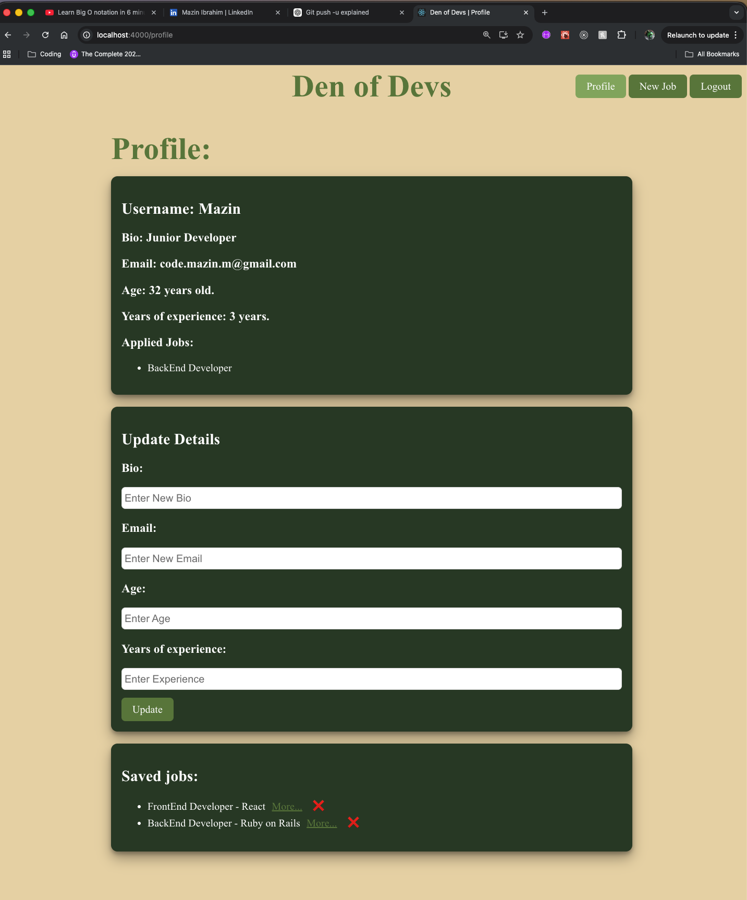
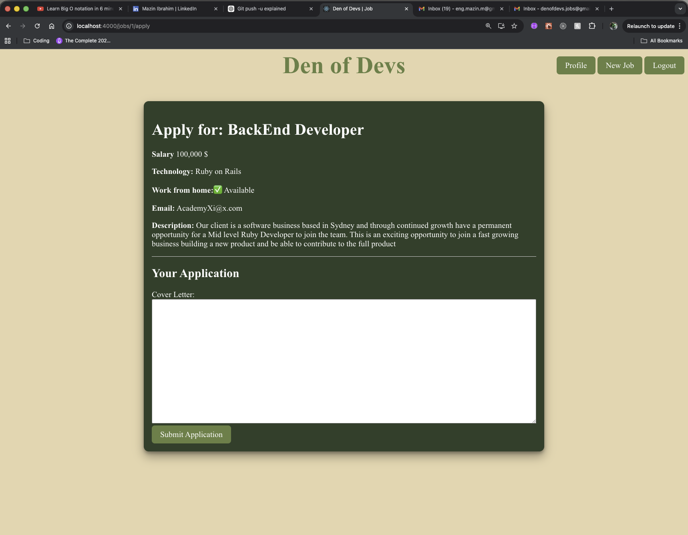

# Den of Devs Job Board  
### Bootcamp Final Project

A full-stack job board application where users can browse jobs, save listings, and apply directly.  
Built with React (frontend) and a Rails API (backend).

---

## 👤 User Stories

- As a junior developer, I want to browse jobs so I can find opportunities  
- As a user, I want to save jobs so I can revisit them later  
- As a user, I want to apply to jobs so I can track my applications and receive confirmation emails  

---

## ✨ Features

- User authentication (signup/login/logout)
- Browse available jobs
- Save jobs to a personal profile
- Apply to jobs with confirmation email
- Admin-only job posting feature
- Search jobs by title or technology
- Responsive UI

---

## 🛠️ Tech Stack

### Frontend
- React
- Styled Components
- React Router

### Backend
- Ruby on Rails API
- SQLite

### Other
- REST API

---

## 📸 Screenshots

### Home Page

### Saved Jobs (Profile)

### Apply to Job

---

## ⚙️ Installation

Clone the repository:

git clone https://github.com/code-mazin/final-project

### Backend Setup

cd backend  
bundle install  
rails db:migrate  
rails s  

### Frontend Setup

cd frontend  
npm install  
npm start  

---

## 🔌 API Endpoints

### Auth
- POST /signup — create user  
- POST /login — login user  
- DELETE /logout — logout user  
- GET /me — get current user  

### Jobs
- GET /jobs — list all jobs  
- GET /jobs/:id — view a single job  
- POST /jobs — create a job  

### Saved Jobs
- GET /saved_jobs — list saved jobs  
- POST /saved_jobs — save a job  
- DELETE /saved_jobs/:id — remove a saved job  

### Applications
- POST /job_applications — apply to a job  

---

## 💡 Usage

- Browse jobs on the homepage  
- Click **Save** to save a job  
- Click **Apply** to submit an application  

---

## 🚀 Future Improvements

- Advanced filtering (salary, remote, tech stack)
- Pagination for job listings
- Improve UI/UX design
- Notifications dashboard for applications

---

## 📬 Contact

To post jobs, email: **denofdev@gmail.com**# Den of Devs Job Board  
### Bootcamp Final Project

A full-stack job board application where users can browse jobs, save listings, and apply directly.  
Built with React (frontend) and a Rails API (backend).

---

## 👤 User Stories

- As a junior developer, I want to browse jobs so I can find opportunities  
- As a user, I want to save jobs so I can revisit them later  
- As a user, I want to apply to jobs so I can track my applications and receive confirmation emails  

---

## ✨ Features

- User authentication (signup/login/logout)
- Browse available jobs
- Save jobs to a personal profile
- Apply to jobs with confirmation email
- Admin-only job posting feature
- Search jobs by title or technology
- Responsive UI

---

## 🛠️ Tech Stack

### Frontend
- React
- Styled Components
- React Router

### Backend
- Ruby on Rails API
- SQLite

### Other
- REST API

---

## 📸 Screenshots

### Home Page

### Saved Jobs (Profile)

### Apply to Job

---

## ⚙️ Installation

Clone the repository:

git clone https://github.com/code-mazin/final-project  
cd final-project  

### Backend (Rails API)

$ bundle install  
$ rails db:migrate db:seed
$ rails s  

### Frontend (React)

$ npm install --prefix client  
$ npm start --prefix client  

> Note: The React app is located in the `client` folder and is started using the `--prefix` flag.
## 🔌 API Endpoints

### Auth
- POST /signup — create user  
- POST /login — login user  
- DELETE /logout — logout user  
- GET /me — get current user  

### Jobs
- GET /jobs — list all jobs  
- GET /jobs/:id — view a single job  
- POST /jobs — create a job  

### Saved Jobs
- GET /saved_jobs — list saved jobs  
- POST /saved_jobs — save a job  
- DELETE /saved_jobs/:id — remove a saved job  

### Applications
- POST /job_applications — apply to a job  

---

## 💡 Usage

- Browse jobs on the homepage  
- Click **Save** to save a job  
- Click **Apply** to submit an application  

---

## 🚀 Future Improvements

- Advanced filtering (salary, remote, tech stack)
- Pagination for job listings
- Improve UI/UX design
- Notifications dashboard for applications

---

## 📬 Contact

To post jobs, email: **denofdev@gmail.com**