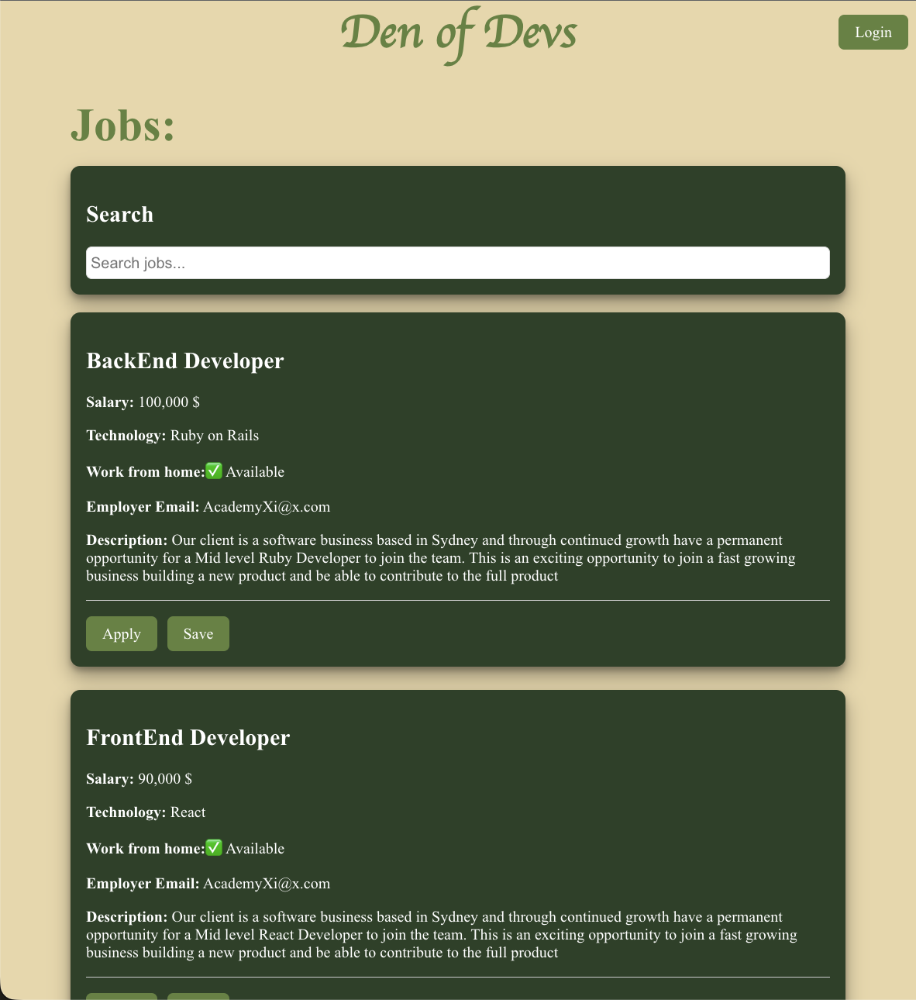
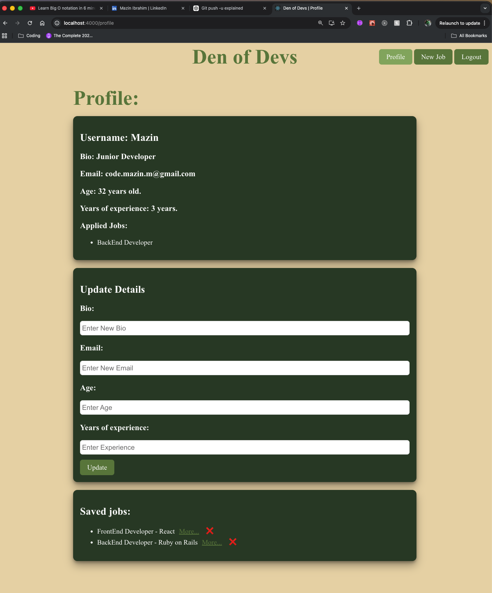
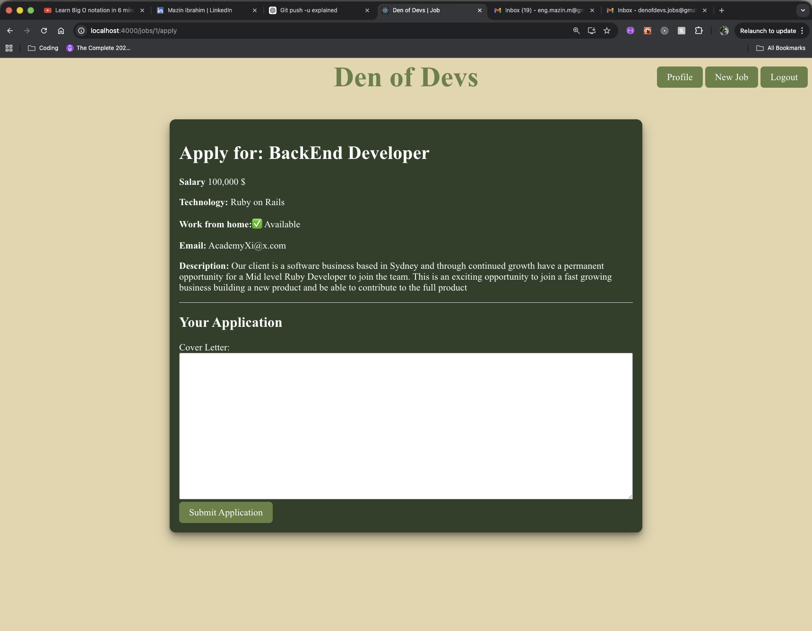

# Den of Devs Job Board  

A full-stack job board application where users can browse jobs, save listings, and apply directly.  
Built with React (frontend) and a Rails API (backend).

---

## 👤 User Stories

- As a junior developer, I want to browse jobs so I can find opportunities  
- As a user, I want to save jobs so I can revisit them later  
- As a user, I want to apply to jobs and receive confirmation emails so I can track my applications  

---

## ✨ Features

- User authentication (signup/login/logout)
- Browse available jobs
- Save jobs to a personal profile
- Apply to jobs with confirmation email
- Admin-only job posting feature
- Search jobs by title or technology
- Responsive UI

---

## 🛠️ Tech Stack

### Frontend
- React
- Styled Components
- React Router

### Backend
- Ruby on Rails API
- SQLite

### Other
- REST API

---

## 📸 Screenshots

### Home Page

### Saved Jobs (Profile)

### Apply to Job

---
## 🌐 Live Demo

Check out the live version of the app:

👉 https://denofdevs-4a1345b4b6e4.herokuapp.com

⚠️ Notes
The app may take a few seconds to load initially (Heroku free tier sleeps)
Some features require authentication (login/signup)
Backend is powered by Rails API and frontend by React

- 🌐 Live deployed app on Heroku
- 📧 Email notifications using ActionMailer + Gmail SMTP

- Some features are still being refined as part of ongoing development

## 🎥 Demo

[Watch Demo Video](https://youtu.be/hp42tr07ud8)

---

## ⚙️ Installation

Clone the repository:

git clone https://github.com/code-mazin/final-project

### Backend Setup

cd final-project  
bundle install  
rails db:migrate  
rails s  

### Frontend Setup

cd final-project  
npm install  
npm start --prefix client

---

## 🔌 API Endpoints

### Auth
- POST /signup — create user  
- POST /login — login user  
- DELETE /logout — logout user  
- GET /me — get current user  

### Jobs
- GET /jobs — list all jobs  
- GET /jobs/:id — view a single job  
- POST /jobs — create a job  

### Saved Jobs
- GET /saved_jobs — list saved jobs  
- POST /saved_jobs — save a job  
- DELETE /saved_jobs/:id — remove a saved job  

### Applications
- POST /job_applications — apply to a job  

---

## 💡 Usage

- Browse jobs on the homepage  
- Click **Save** to save a job  
- Click **Apply** to submit an application  

---

## 🚀 Challenges

* SQLite not working on Heroku 
    worked around the issue by switching to PostgreSQL for Heroku and keeping SQLite for local development
    - Added the pg gem to Rails project
    - Configured PostgreSQL for production
    - Created a Heroku PostgreSQL database
    - Ran all your migrations successfully
    - seeded jobs

---

## Lessons from this project

* I was using SQLite for development and learnt that its not ideal for production as it cant hold data for long

## 🚀 Future Improvements

- Advanced filtering (salary, remote, tech stack)
- Pagination for job listings
- Improve UI/UX design
- Notifications: Notify users of new job postings that match their search
- Notify employers of new applications.

---

## 📬 Contact

To post jobs, email: **denofdev@gmail.com**# Den of Devs Job Board  